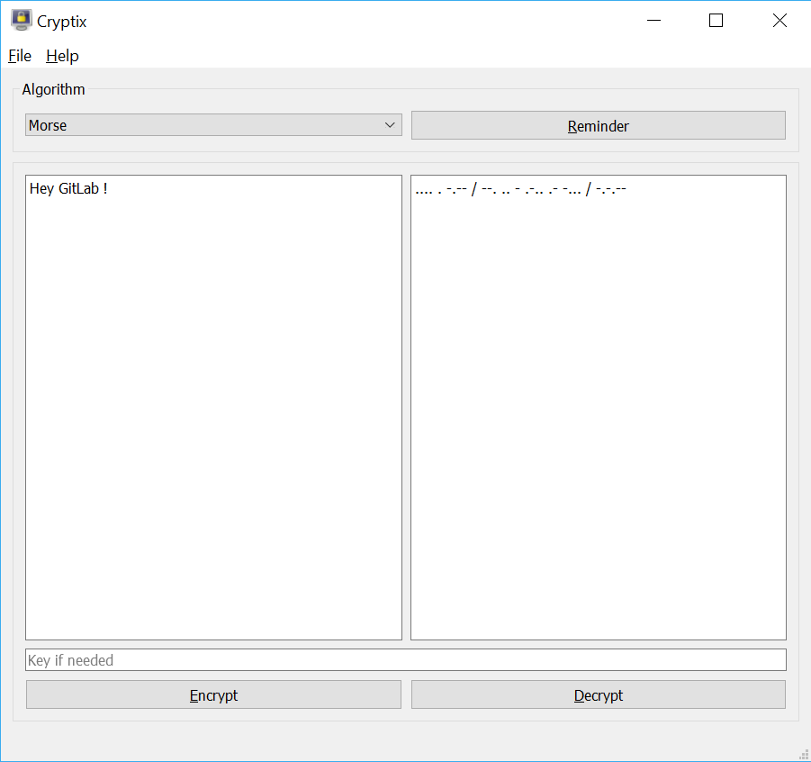
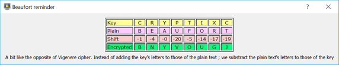

# Cryptix
A tool to easily encrypt and decrypt text with your favorite cyphers

## Overview

Main interface



A quick reminder is available for each cypher so that you know what you're dealing with.



> Are there only traditional cyphers ?

Not necessarily, in the future there might be anything I find useful, like hashing or some steganography ;
and there are already exotic things such as Morse code.

### Current cyphers

* Monoalphabetic substitution
    * Caesar
    * Polybe
    * Wolseley
    * Morse
* Polyalphabetic substitution
    * Vigenere
    * Beaufort
    * Gronsfeld

### Already planned

* Monoalphabetic substitution
    * Unordered alphabet
* Polyalphabetic substitution
    * Philips
* Tomogrammic cyphers
    * ADFGVX
    * Collon
    * Delastelle
* Polygrammic cyphers
    * Affine
    * Hill
    * Playfair

### Maybe in the future

* HayHanen microfilm

* Merkle-Hellman, Rabin, RSA

* Pigpen
      Some image generation would be easy,
      but analysing it would be way harder

* Your suggestions (open an issue)

## Cross-platform

Created with Python and [Qt for Python](https://wiki.qt.io/Qt_for_Python), the app aims to be as much portable as possible.

As such, it is available for Windows, Mac OS and Linux, with Python 3.6 or newer. Though, due to Qt platform support,
Mac OS and Linux users should use it in a 64-bit architecture.

### Installation

The application is currently still developed and hasn't been released on a per-platform basis yet.

However you can test yourself the application at its current state.

Make sure `PySide2` is installed, it should be at least `5.11` but preferably `5.12` or newer

```bash
pip install PySide2
```

Clone the repository

```bash
git clone https://github.com/FrenchMasterSword/Cryptix.git
```

To start the application, run `cryptix.py` with Python 3.6 or newer.
